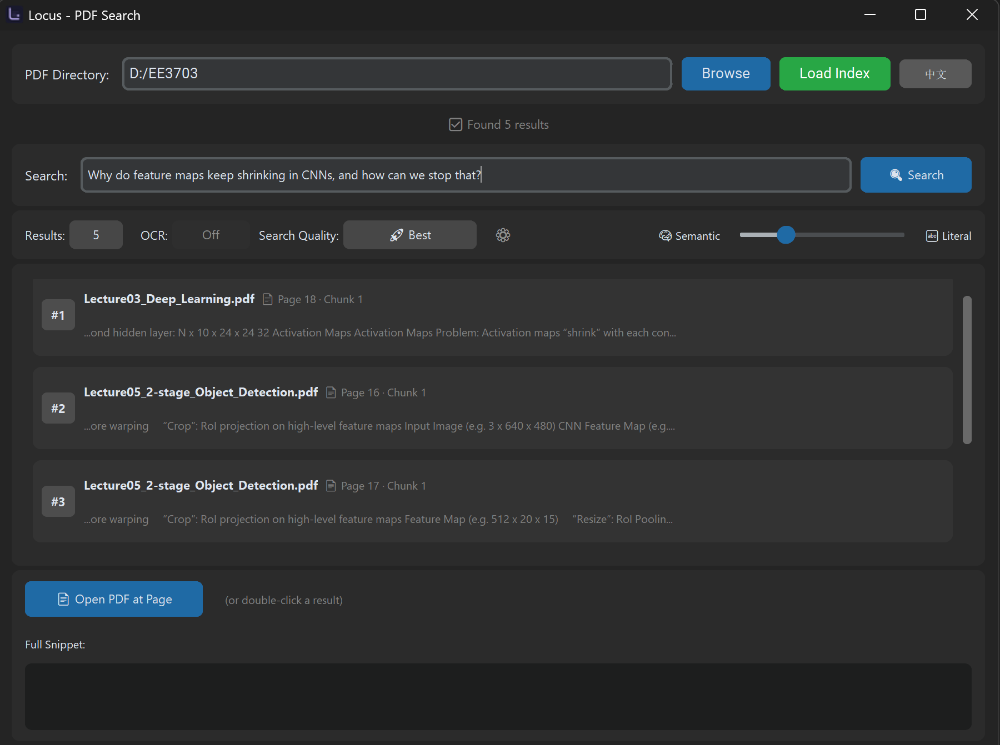

# Locus - PDF Semantic Search

**Find the exact page that answers your question.**
<p align="center">
  
</p>


A lightweight desktop app for students and researchers to search PDF folders using natural language.


---

## Features

- **Hybrid search**: BM25 keyword retrieval + semantic reranking (FastEmbed)
- **Two index modes**: Fast (quick startup) and Deep (precomputed embeddings)
- **Chunked indexing**: better precision while keeping page numbers
- **Optional OCR**: for scanned PDFs or image-only pages
- **Multilingual search**: cross-lingual matching with the multilingual model
- **Open PDF at page**: jump directly to the relevant page
- **Model manager**: download/delete models and choose fusion method

---

## Quick Start

### Option A: Windows EXE
Download the latest release from [Releases](https://github.com/llk214/locus/releases) and run `Locus.exe`.

### Option B: Run from source

```bash
# Install dependencies
pip install -r requirements.txt

# Run
python gui.py
```

---

## How to Use

1. Click **Browse** and select a folder containing PDFs.
2. Click **Load Index** (or **Rebuild Index** when files/models change).
3. Choose index mode:
   - **Fast Index**: faster startup, good for small collections
   - **Deep Index**: slower startup, best recall
4. Type a query and press **Search**.
5. Double-click a result to open the PDF at the correct page.

---

## Search Quality (Models)

- **Balanced / High / Best** control embedding model size and accuracy.
- **Multilingual** enables cross-lingual search.

> Tip: Use the **Manage Models** window to download/delete models.

---

## OCR

- OCR is **off by default** and can be enabled in the OCR selector.
- **Fast mode**: OCR only for image-heavy pages with little text.
- **Deep mode**: OCR for all pages that contain images.

OCR results are cached to speed up later runs.

---

## Score Fusion

Choose in **Manage Models**:
- **RRF (Rank Fusion)** (default)
- **Percentile Blend**

---

## Caches

Caches are stored outside your PDF folder:

- **Index cache**: 
  - Windows: `%LOCALAPPDATA%\Locus\index_cache`
  - macOS: `~/Library/Caches/Locus/index_cache`
  - Linux: `~/.cache/Locus/index_cache`
- **OCR cache**:
  - Windows: `%LOCALAPPDATA%\Locus\ocr_cache`
  - macOS: `~/Library/Caches/Locus/ocr_cache`
  - Linux: `~/.cache/Locus/ocr_cache`
- **Model cache**:
  - Windows: `%LOCALAPPDATA%\Locusastembed_cache`
  - macOS: `~/Library/Caches/Locus/fastembed_cache`
  - Linux: `~/.cache/Locus/fastembed_cache`

Use **Manage Models** to clear index or OCR cache.

---

## Requirements

- Python 3.8+
- PDF viewer with page navigation support (SumatraPDF recommended on Windows)

Dependencies:
```
PyMuPDF
rank-bm25
fastembed
numpy
customtkinter
rapidocr-onnxruntime
```

---

## FAQ

**Why is indexing slow?**  
Deep mode precomputes embeddings and OCR can be expensive. Use Fast mode or lower OCR quality.

**Why don't I see a score in RRF mode?**  
RRF is rank-based; numeric scores are hidden by design.

---

## License

MIT - free for personal and educational use.
